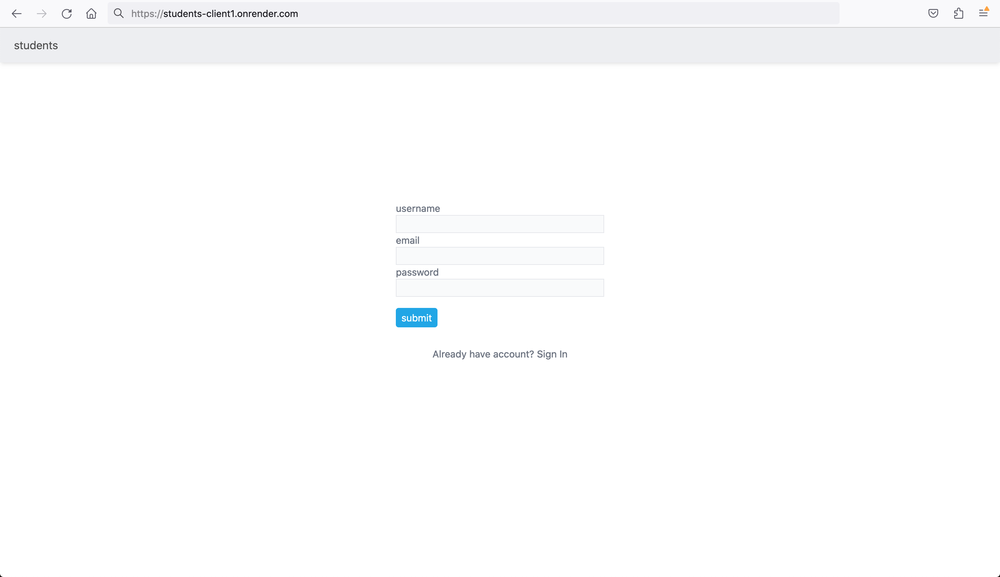
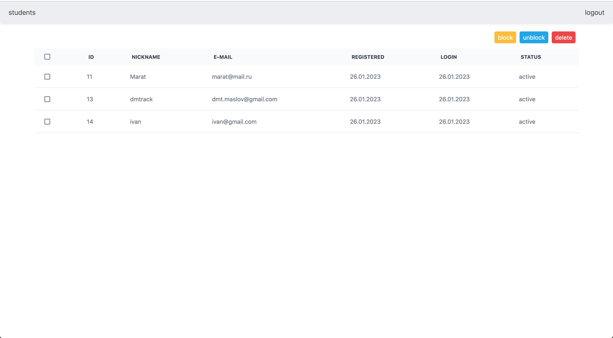

## students-table

[https://students-client1.onrender.com](https://students-client1.onrender.com)

### Description

This project is a homework task while training to get offer in company
It is a table that saves users information in data-base and allows to manage it

### Stack

Front

-   typeScript
-   react hooks
-   react Routes
-   reduxToolkit
-   tailWind

Backend:

-   typeScript
-   node.js
-   express
-   sequalize

DB PostgreSQL

### Preview

